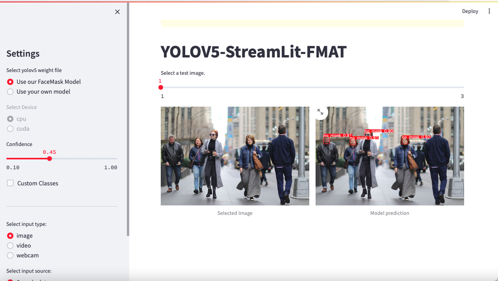

# YOLOV5-StreamLit-FMAT

This is a demo using StreamLit app that allows a user to upload image(s), video(s) and webcam, it contains some images and videos, for test the YOLOv5 Model for facemask, made for user friendly, can be used by user basic knowledge, so you can access this interface through a web browser at localhost:8501

This is used from project of master en computer science for FMAT - UADY. For detec facemask with YOLOv5 and Streamlit for use model detection of facemask.

## Requirements
Python 3.8 or later with all requirements.txt dependencies installed, including torch>=1.7 (per https://github.com/ultralytics/yolov5).

## Installation

Use the package manager [pip](https://pip.pypa.io/en/stable/) to install YOLOV5-StreamLit-FMAT.

```bash
pip install -r requirements.txt
```

## Usage

```bash
python3 streamlit run app.py
```

## Screen Shots


## Contributing

Pull requests are welcome. For major changes, please open an issue first
to discuss what you would like to change.

Please make sure to update tests as appropriate.

## License


## Contact

Feel free to contact me: victor941@gmail.com